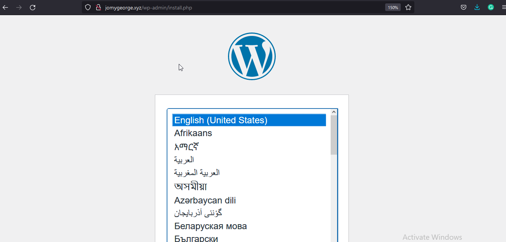
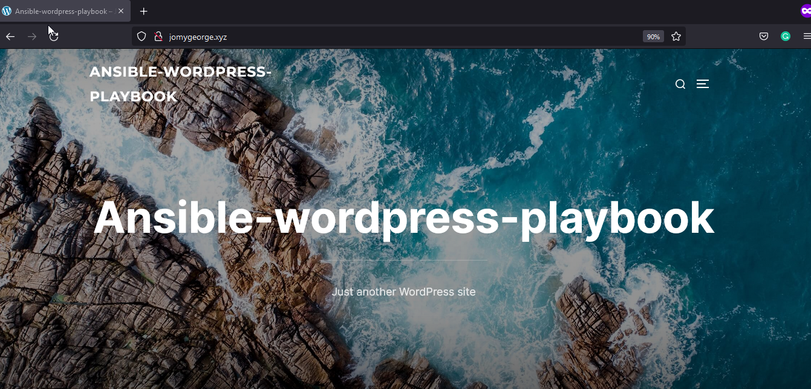

# Ansible-playbook-wordpress-LAMP

[](https://travis-ci.org/joemccann/dillinger)

---

## Description 

Ansible playbook for creating the Mariadb, Php, Wordpress and Apache on client node using Ansible Master node. 

----
## Pre-Requests
- Need to install Ansible on Master node to run
-----

## Includes

- Mariadb
- php
- wordpress
- Apache

### Ansible installation 

```sh
sudo amazon-linux-extras install ansible2 -y

ansible --version
ansible 2.9.23
  config file = /etc/ansible/ansible.cfg
  configured module search path = [u'/home/ec2-user/.ansible/plugins/modules', u'/usr/share/ansible/plugins/modules']
  ansible python module location = /usr/lib/python2.7/site-packages/ansible
  executable location = /usr/bin/ansible
  python version = 2.7.18 (default, Jun 10 2021, 00:11:02) [GCC 7.3.1 20180712 (Red Hat 7.3.1-13)]
```


### Behind the code : hosts file
```sh
[amazon]                                                                                          >>>>  Group name i have provided
<server IP> ansible_user="ec2-user" ansible_port=22 ansible_ssh_private_key_file="ansible.pem"
```
### Behind the code : main.yml
```sh
---

- name: "Installing WordPress with LAMP Stack on Amazon Linux"
  hosts: all
  become: true
  vars:
    domain_name: jomygeorge.xyz
    httpd_port: 80
    URL: https://wordpress.org/latest.zip
    mysql_root_password: root@123
    wp_user_name: wpuser
    wp_user_password: wp@123
    httpd_owner: apache
    httpd_group: apache
    wp_db_name: wordpressdatabase

  tasks:

    - name: "APACHE WEBSERVER INSTALLATION"
      yum:
        name:
          - httpd
        state: present

    - name: "Installing PHP"
      shell: "amazon-linux-extras install php7.2 -y"

    - name: "Adding Virtualhost form local to destination"
      template:
        src: virtualhost.conf.j2
        dest: /etc/httpd/conf.d/{{ domain_name }}.conf
        owner: "{{ httpd_owner }}"
        group: "{{ httpd_group}}"

    - name: "Creating Documentroot for {{ domain_name}}"
      file:
        state: directory
        path: /var/www/html/{{ domain_name }}
        owner: "{{ httpd_owner }}"
        group: "{{ httpd_group}}"

    - name: "Start & Enable Apache webserver"
      service:
        name: httpd
        state: restarted
        enabled: true

    - name: "Installing and setting up the Mariadb-server"
      yum:
        name:
          - mariadb-server
          - MySQL-python
        state: present
      register: mariadb_status

    - name: "Restarting & Enabling Mariadb"
      when: mariadb_status.changed == true
      service:
        name: mariadb
        state: restarted
        enabled: true

    - name: "Setup Root password for root user"
      when: mariadb_status.changed == true
      mysql_user:
        login_user: root
        login_password: ""
        name: root
        password: "{{ mysql_root_password }}"
        host_all: yes


    - name: "Create and passing the file from local to destination /root/.my.cnf"
      when: mariadb_status.changed == true
      template:
        src:  my.cnf
        dest: /root/.my.cnf
        owner: root
        group: root

    - name: "Removing mariadb anonymous users"
      when: mariadb_status.changed == true
      mysql_user:
        config_file: /root/.my.cnf
        host_all: true
        name: ""
        state: absent

    - name: "Remove test database from mariadb"
      when: mariadb_status.changed == true
      mysql_user:
        config_file: /root/.my.cnf
        name: test
        state: absent


    - name: "Creating the wordpress database"
      mysql_db:
        config_file: /root/.my.cnf
        name: "{{ wp_db_name }}"
        state: present

    - name: "Creating Wordpress user"
      mysql_user:
        config_file: /root/.my.cnf
        name: "{{ wp_user_name }}"
        password: "{{ wp_user_password }}"
        priv: '{{ wp_db_name }}.*:ALL'
        state: present


    - name: "Downloading the Wordpress zip file on remote meachine"
      get_url:
        url: "{{ URL }}"
        dest: /tmp/wordpress.zip

    - name: "Extracting Wordpress file on remote meachine"
      unarchive:
        remote_src: yes
        src: /tmp/wordpress.zip
        dest: /tmp/

    - name: "Moving Wordpress extracted files to website Document root"
      copy:
        remote_src: yes
        src: /tmp/wordpress/
        dest: /var/www/html/{{ domain_name }}/
        owner: "{{ httpd_owner }}"
        group: "{{ httpd_group}}"

    - name: "Creating wp-config.php and pass to remote meachine"
      template:
        src: wp-config.php
        dest: /var/www/html/{{ domain_name }}/wp-config.php
        owner: "{{ httpd_owner }}"
        group: "{{ httpd_group}}"

    - name: "Post installation restart for the httpd and mariadb service"
      service:
        name: "{{ item }}"
        state: restarted
      with_items:
        - httpd
        - mariadb
```
### Behind the code : my.cnf
```
[client]
user= root
password={{ mysql_root_password }}
```
### Behind the code : virtualhost.conf.j2
```
<virtualhost *:{{ httpd_port }}>

  servername {{ domain_name }}
  documentroot /var/www/html/{{ domain_name }}
  directoryindex index.php index.html

  <directory "/var/www/html/{{ domain_name }}">
     allowoverride all
  </directory>

</virtualhost>
```

### Behind the code : wp-config.php 
```
You need to provide the variable name on wp-config.php as i have uploaded above
```

> Lets us check the syntax of our code using below
```
 ~]$ ansible-playbook -i hosts main.yml --syntax-check
playbook: main.yml
```
> Let run the code and call the domain name on browser to access the wordpress dashboard

```
~]$ ansible-playbook -i hosts main.yml

PLAY [Installing WordPress with LAMP Stack on Amazon Linux] ************************************************************
TASK [Gathering Facts] *************************************************************************************************[WARNING]: Platform linux on host 172.31.34.80 is using the discovered Python interpreter at /usr/bin/python, but
future installation of another Python interpreter could change this. See
https://docs.ansible.com/ansible/2.9/reference_appendices/interpreter_discovery.html for more information.
ok: [172.31.34.80]

TASK [APACHE WEBSERVER INSTALLATION] ***********************************************************************************
changed: [172.31.34.80]

TASK [Installing PHP] **************************************************************************************************
changed: [172.31.34.80]

TASK [Adding Virtualhost form local to destination] ********************************************************************
changed: [172.31.34.80]

TASK [Creating Documentroot for jomygeorge.xyz] ************************************************************************
changed: [172.31.34.80]

TASK [Start & Enable Apache webserver] *********************************************************************************
changed: [172.31.34.80]

TASK [Installing and setting up the Mariadb-server] ********************************************************************
changed: [172.31.34.80]

TASK [Restarting & Enabling Mariadb] ***********************************************************************************
changed: [172.31.34.80]

TASK [Setup Root password for root user] *******************************************************************************
[WARNING]: Module did not set no_log for update_password
changed: [172.31.34.80]

TASK [Create and passing the file from local to destination /root/.my.cnf] *********************************************
changed: [172.31.34.80]

TASK [Removing mariadb anonymous users] ********************************************************************************
changed: [172.31.34.80]

TASK [Remove test database from mariadb] *******************************************************************************
ok: [172.31.34.80]

TASK [Creating the wordpress database] *********************************************************************************
changed: [172.31.34.80]

TASK [Creating Wordpress user] *****************************************************************************************
changed: [172.31.34.80]

TASK [Downloading the Wordpress zip file on remote meachine] ***********************************************************
changed: [172.31.34.80]

TASK [Extracting Wordpress file on remote meachine] ********************************************************************
changed: [172.31.34.80]

TASK [Moving Wordpress extracted files to website Document root] *******************************************************
changed: [172.31.34.80]

TASK [Creating wp-config.php and pass to remote meachine] **************************************************************
changed: [172.31.34.80]

TASK [Post installation restart for the httpd and mariadb service] *****************************************************
changed: [172.31.34.80] => (item=httpd)
changed: [172.31.34.80] => (item=mariadb)

PLAY RECAP *************************************************************************************************************
172.31.34.80               : ok=19   changed=17   unreachable=0    failed=0    skipped=0    rescued=0    ignored=0
```
<center> </img></center>

<center> </img></center>

 ## Conclusion

Created the wordpress with php, mysql, apache using ansible playbook


#### ⚙️ Connect with Me

<p align="center">
<a href="mailto:jomyambattil@gmail.com"></a>
<a href="https://www.linkedin.com/in/jomygeorge11"></a> 
<a href="https://www.instagram.com/therealjomy"></a><br />
